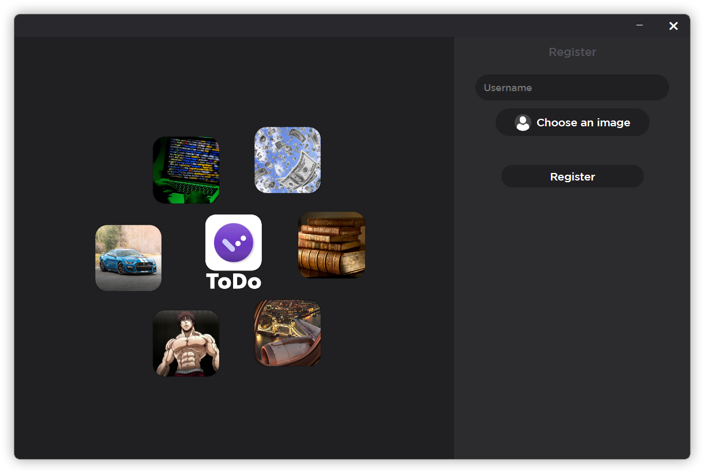

<h1 align="center">
  <br>
  
  <br>
</h1>

<p align="center">
  <a href="#key-features">Key Features</a> •
  <a href="#how-to-use">How To Use</a> •
  <a href="#credits">Credits</a> •
  <a href="#license">License</a> •
  <a href="#assets">Assets</a>
</p>

<video align="center">
  <source src="https://www.veed.io/view/43ab658b-874e-4706-9d72-e63318e82e6b?panel=share" type="video/mp4">
</video>

## Key Features

* Everything is stored
  - You leave the application, you find all your tasks done previously
* Your first time on the app?
  - create your account
* App will keep alive in tray for quick usage
* Full screen mode
* Cross platform
  - Windows, macOS and Linux ready.
* Source code available
  - For developers who want to get inspired or improve the app

## How To Use

To clone and run this application, you'll need [Git](https://git-scm.com) and [Node.js](https://nodejs.org/en/download/) (which comes with [npm](http://npmjs.com)) installed on your computer. From your command line:

```bash
# Clone this repository
$ git clone https://github.com/thomasperge/ToDo-App.git

# Go into the repository
$ cd ToDo-App-main

# Install dependencies
$ npm install

# Run the app
$ npm start
```

## Credits

This software uses the following open source packages:

- [Electron](http://electron.atom.io/)
- [Node.js](https://nodejs.org/)
- [Chart.js](https://www.chartjs.org/)

## License

MIT

## Assets : 




> GitHub [@thomasperge](https://github.com/thomasperge) &nbsp;&middot;&nbsp;

